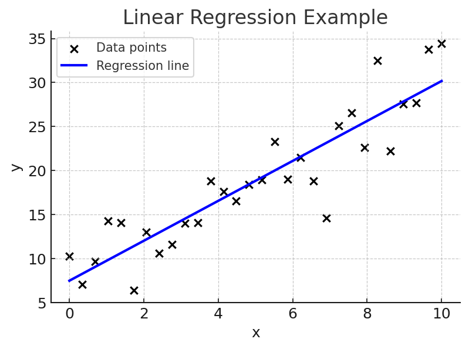

# Linear Regression

Linear regression is one of the simplest and most widely used machine learning techniques.  
It models the relationship between an **input variable** (or several inputs) and an **output variable** by fitting a straight line (or hyperplane) through the data.

---

## The Equation

For a single input variable \( x \), the model is:

\[
y = w x + b
\]

- \( y \) → predicted output  
- \( x \) → input variable  
- \( w \) → weight (slope of the line)  
- \( b \) → bias (intercept)  

For multiple input variables:

\[
y = w_1 x_1 + w_2 x_2 + \dots + w_n x_n + b
\]

---

## How It Works

- **Inputs:** numerical data (e.g., beam length, load, temperature).  
- **Outputs:** a predicted continuous value (e.g., deflection, stress, efficiency).  
- **Goal:** find the best line (or hyperplane) that minimizes the difference between predicted and actual values.

---

## Example Illustration

Here’s a simple linear regression line fit through a set of data points:

*(In this example, the blue line is the model prediction, and the black points are actual data.)*

---

## Engineering Applications

- Predicting **material properties** (e.g., tensile strength vs. composition).  
- Estimating **drag coefficient** from geometry.  
- Correlating **beam deflection** with load and length.  

---

!!! note
    Linear regression is often used as a baseline model. If it performs well, more complex machine learning models may not be needed.
